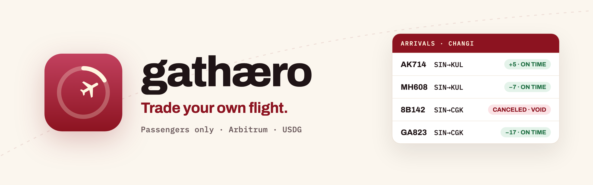
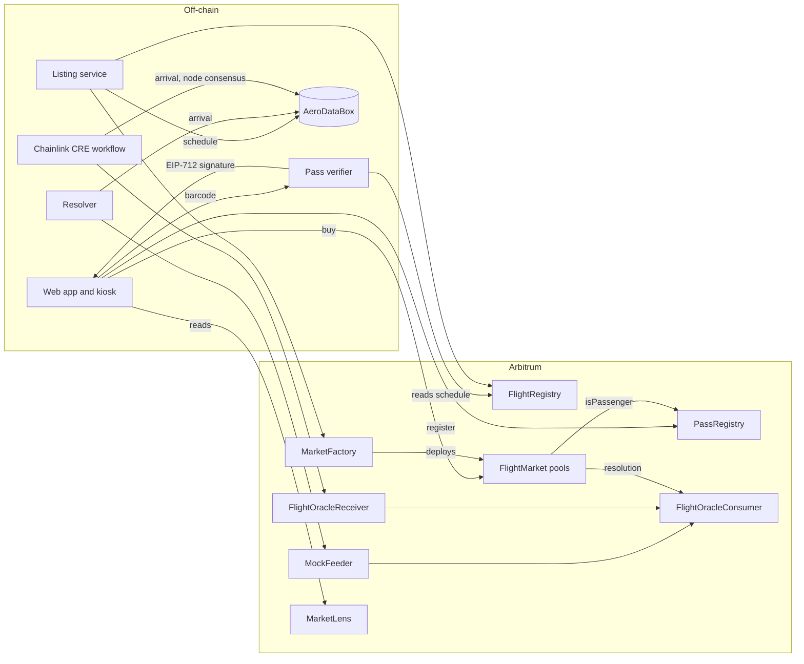

<p align="center"></p>

# Gathæro

**Trade your own flight.** Gathæro is a flight market on Arbitrum that only the
people on board can use. A traveller scans their boarding pass, the pass is
linked to their wallet on-chain, and they can **protect** against a delay or
**predict** the arrival time. Every market settles in USDG from the flight's real
gate arrival, with no claim to file.

[](contracts)
[](#testing)
[](https://sepolia.arbiscan.io/address/0xeD2c783B0037567c1f0ddf221cCb7649d185C4eF)
[](#tech-stack)
[](cre)
[](app)
[](app/tsconfig.json)
[](LICENSE)

| | |
|---|---|
| **The app** | <https://gathaero.space> |
| **Kiosk mode, as a gate screen would show it** | <https://gathaero.space/kiosk> |
| **The market factory, on Arbiscan** | [`0xeD2c…C4eF`](https://sepolia.arbiscan.io/address/0xeD2c783B0037567c1f0ddf221cCb7649d185C4eF) |
| **A real flight, settled from real data** | [AK714 SIN→KUL, 3 Oct, 5 min late, settled On time](https://sepolia.arbiscan.io/tx/0x43736bfe1a69ea6c388eed67e33b94e395175def81ad14df2e072deffca836c0) |

---

## Built during the buildathon

Gathæro is entered at the **Arbitrum Open House Singapore** online buildathon.
The repository was created on 1 October 2026 and every commit in it was written
during the event, so the whole history is the entry:

```bash
git log --reverse --format="%ad %s" --date=short
```

**Built at the event:** the contracts, the boarding pass verifier, the listing
and settlement services, the Chainlink CRE workflow, the web app, the kiosk
mode, and three deployments to Arbitrum Sepolia.

**Reused:** open-source libraries (OpenZeppelin, viem, wagmi, zxing) and a
private UI component library written before the event, which the app imports as
a local package.

---

## Contents

[Overview](#overview) · [The solution](#the-solution) ·
[One flight, end to end](#one-flight-end-to-end) · [Architecture](#architecture) ·
[The rules](#the-rules-and-where-each-one-lives) · [Markets and pricing](#markets-and-pricing) ·
[Settlement](#settlement) · [Boarding pass verification](#boarding-pass-verification) ·
[Kiosk mode](#kiosk-mode) · [What is deployed](#what-is-deployed) ·
[Quick start](#quick-start) · [What this does not claim](#what-this-does-not-claim) ·
[Security review](#security-review) ·
[Tech stack](#tech-stack) · [Partner technology](#partner-technology) ·
[Repository structure](#repository-structure) · [Testing](#testing) ·
[Running it](#running-it) · [Roadmap](#roadmap) · [Licence](#licence)

---

## Overview

About one in four flights on Southeast Asia's largest airlines arrives late. In
May 2025 Singapore Airlines arrived within 15 minutes of schedule 76.3% of the
time, AirAsia 77.0% and Garuda Indonesia 81.1% (Cirium). When a flight is late,
the traveller pays for it: the extra meal, the missed transfer, the night in a
hotel. Travel insurance pays back weeks later, after a claim form and proof of
delay.

Prediction markets showed there is demand to price flights. In July 2026 Kalshi
opened markets on flight cancellations to anyone; within weeks FlightAware sued,
warning that such markets give people a reason to disrupt flights. An open
market on a flight invites exactly the people who can influence it.

**Gathæro is a flight market that only the people on board can trade.** Each
flight gets its own pools, every trader is a verified passenger of that flight,
trading closes at departure, and the outcome comes from the flight's actual gate
arrival.

---

## The solution

- A flight is **listed** with its real schedule from AeroDataBox: departure,
  arrival, route, and a delay threshold of 30 minutes.
- A traveller **scans their boarding pass**. A verifier checks the flight
  number, route and date against the on-chain schedule and signs an EIP-712
  attestation for that traveller's wallet.
- The traveller **registers the pass** in `PassRegistry` with one transaction.
  From then on that wallet is a passenger of that flight, and the pass can never
  be used by another wallet.
- The passenger trades their flight in two ways:
  - **Protect:** buy the Delayed side of the protection pool at the market's
    live delay probability, as a hedge against a late arrival.
  - **Predict:** trade Yes or No on arrival windows, for example "arrives 10 to
    30 minutes late", and back their own read of the flight.
- **Trading closes at scheduled departure**, before anyone can see the arrival
  coming.
- About **30 minutes after arrival** the resolver reads the gate arrival, writes
  the delay on-chain once, and settles every market for that flight.
- If the flight was more than 30 minutes late, protection **pays 1 USDG per share**.
  Liquidity providers keep the premiums when it was on time.

> Insurance asks you to prove a loss. Gathæro pays on the flight's public
> arrival time, which nobody on board can change.

---

## One flight, end to end

| When | What happens | Where |
|---|---|---|
| Day before | Listing reads the schedule and registers the flight, then opens a protection pool and four arrival-window pools, seeded with opening odds | `feeder/src/listing.ts` → `FlightRegistry.registerFlight`, `MarketFactory.createProtection`, `createRange` |
| At the gate | Traveller scans the boarding pass; verifier signs `Pass(flightId, wallet, passHash, expiry)` | `feeder/src/verifier.ts` |
| At the gate | Traveller registers the pass | `PassRegistry.register` |
| Before departure | Traveller buys protection or a window | `FlightMarket.buy` |
| Scheduled departure | Every market for the flight stops trading | `FlightMarket.isTrading` |
| Arrival + 30 min | Resolver reads AeroDataBox; when the flight is `Arrived`, it writes the delay | `feeder/src/resolve.ts` → `MockFeeder.feed` → `FlightOracleConsumer` |
| Same transaction batch | Each market resolves against the recorded delay | `FlightMarket.resolve` |
| Any time after | Winners redeem; LPs withdraw | `FlightMarket.redeem`, `removeLiquidity` |

---

## Architecture



| Contract | Job |
|---|---|
| `FlightRegistry` | Schedules: number, route, scheduled departure and arrival, delay threshold. Written once per flight. |
| `PassRegistry` | Which wallet is a passenger of which flight, and which wallet holds each boarding pass. |
| `MarketFactory` | Deploys one protection pool and any number of arrival-window pools per flight. |
| `FlightMarket` | A fixed-product market maker over two outcomes, with proportional liquidity, the passenger gate and the stake cap. |
| `OutcomeToken` | ERC-1155 shares for On time and Delayed, one token contract per market, non-transferable between wallets. |
| `FlightOracleConsumer` | The delay of each flight, written once and then final. |
| `FlightOracleReceiver` | The Chainlink CRE entry point; accepts reports only from the configured workflow owner. |
| `MockFeeder` | The resolver's reporter while CRE is not deployed. |
| `MarketLens` | One call for every flight and its markets, and one for a wallet's positions. |

---

## The rules, and where each one lives

| Rule | Enforced in | Refusal |
|---|---|---|
| Only verified passengers of a flight can buy on its markets | `FlightMarket.buy` → `PassRegistry.isPassenger` | `NotPassenger` |
| A boarding pass links to one wallet | `PassRegistry.register`, `holderOf[passHash]` | `PassAlreadyUsed` |
| An attestation works only for the wallet it was signed for, and only for 15 minutes | EIP-712 `Pass(flightId, wallet, passHash, expiry)` | `Unauthorized`, `PassExpired` |
| A wallet can put at most 200 USDG into one market | `FlightMarket.MAX_STAKE`, `staked[wallet]` | `StakeLimitExceeded` |
| Positions stay with the wallet that bought them | `OutcomeToken._update` | `NotTransferable` |
| Trading closes at scheduled departure | `FlightMarket.scheduledDeparture` | `MarketClosed` |
| A flight's delay is recorded once | `FlightOracleConsumer` | `AlreadyFinalized` |
| A new LP cannot move the price | proportional add, excess shares returned to the LP | — |

The operator that lists a market seeds its opening odds and is the one address
the passenger rule does not apply to.

---

## Markets and pricing

Every market holds reserves of two outcome shares, On time and Delayed, and
prices them with a constant product. The price of Delayed is the market's delay
probability, so a passenger buying protection at 14% receives roughly 7 shares
per dollar, and each share pays 1 USDG if the flight is late.

- **Protection pool**, one per flight: Delayed wins when the flight arrives more
  than `delayThresholdMinutes` (30) after its scheduled arrival.
- **Arrival windows**, four per flight by default (−20 to −5, −5 to 10, 10 to 30
  and 30 to 60 minutes against schedule): Yes wins when the gate arrival falls
  inside the window.
- **Liquidity** is added in proportion to the pool, so a second LP never moves
  the odds. Each LP's principal is tracked, and a voided market returns it in
  full.
- **Opening odds** come from each route's on-time history and are set by the
  operator's first trade. After that, only passengers move the price.

---

## Settlement

**Delay is the actual arrival minus the scheduled arrival recorded on-chain at
listing.** The actual arrival is AeroDataBox `revisedTime`, which is the gate
arrival and the time airlines report on-time performance against, falling back
to `runwayTime` (touchdown). A flight settles only once AeroDataBox reports it
`Arrived` with one of those times; until then it stays pending and is retried
every ten minutes.

- Arrived more than 30 minutes late: Delayed wins and protection pays.
- Arrived 30 minutes late or less: On time wins and LPs keep the premiums.
- `Canceled` or `Diverted`: every market for the flight is voided and every
  premium and LP principal is refunded.

The resolver waits 30 minutes after scheduled arrival before it looks, so a
typical payout is final about half an hour after the flight reaches the gate.

---

## Boarding pass verification

The barcode on every boarding pass is an IATA BCBP string. Gathæro reads it
with zxing (PDF417, Aztec and QR) from the camera or a photo, and parses the
fixed-width fields: passenger name, booking reference, origin, destination,
carrier and flight number, day of year and seat.

The verifier (`feeder/src/verifier.ts`) then:

1. reads the flight from `FlightRegistry` and checks the flight number, the
   route and the departure day against the pass;
2. refuses a pass already linked to another wallet, and a wallet already
   verified for that flight, before anything reaches the chain;
3. computes `passHash = keccak256(flightId, bookingReference, passenger)`, so
   no name or booking reference is ever stored on-chain;
4. signs `Pass(flightId, wallet, passHash, expiry)` with EIP-712, valid for 15
   minutes.

The traveller submits that signature to `PassRegistry.register` from their own
wallet. The registry checks the signer, the expiry, and that the pass is not
already held by another wallet.

---

## Kiosk mode

`/kiosk` is the screen an airport would put at the gate. It never holds a
wallet.

1. The traveller scans their boarding pass. The kiosk finds the flight's open
   market.
2. The traveller shows the Receive QR code from their wallet app, or types the
   address.
3. The verifier signs the pass for that address, and the kiosk shows a QR code.
4. The traveller scans it with their phone. `/claim` opens in the wallet's
   browser, where they link the pass and buy, signing on their own device.

The hand-off QR carries the flight id, the pass hash, the expiry and the
signature. It carries no name and no booking reference. The kiosk clears itself
when the code expires or after three idle minutes.

---

## What is deployed

Arbitrum Sepolia, chain **421614**. Deployed in block `315275472`.

| Contract | Address |
|---|---|
| `MarketFactory` | [`0xeD2c783B0037567c1f0ddf221cCb7649d185C4eF`](https://sepolia.arbiscan.io/address/0xeD2c783B0037567c1f0ddf221cCb7649d185C4eF) |
| `FlightRegistry` | [`0xdEb849013D7CEcfc5749B590317965B860bF5739`](https://sepolia.arbiscan.io/address/0xdEb849013D7CEcfc5749B590317965B860bF5739) |
| `PassRegistry` | [`0x31232BC4dB2cbB7d62295Ac799270cb2DFfAfC76`](https://sepolia.arbiscan.io/address/0x31232BC4dB2cbB7d62295Ac799270cb2DFfAfC76) |
| `FlightOracleConsumer` | [`0xa14449d14c5812234448Dac636c86037B0564CC3`](https://sepolia.arbiscan.io/address/0xa14449d14c5812234448Dac636c86037B0564CC3) |
| `FlightOracleReceiver` | [`0xd0f2bcF880348341Ba0f695da3358E0D46c2A50a`](https://sepolia.arbiscan.io/address/0xd0f2bcF880348341Ba0f695da3358E0D46c2A50a) |
| `MockFeeder` | [`0x7C320F1e88BbE4c60404A0C712b6DE2CFe6fABff`](https://sepolia.arbiscan.io/address/0x7C320F1e88BbE4c60404A0C712b6DE2CFe6fABff) |
| `MarketLens` | [`0x2d40841aA005837f3BF21D3FA9dA66301D519a64`](https://sepolia.arbiscan.io/address/0x2d40841aA005837f3BF21D3FA9dA66301D519a64) |
| Test USDG (6 decimals, open mint) | [`0xA50d9454E71aCf152399C872815ae6895cB53229`](https://sepolia.arbiscan.io/address/0xA50d9454E71aCf152399C872815ae6895cB53229) |

The verifier signs from `0x7A5d66675fc1f54E090aEf404832788430e88e97`, an
address that holds no funds. Every flight's pools are listed by
`MarketLens.flights()`, and each market's address is shown in the app's
Contracts panel.

Earlier deployments are kept on-chain and no longer used by the app: v1 had no
passenger rule, and v2 gated only the Delayed side of protection. The first
real settlement happened on v2: AirAsia AK714 on 3 October arrived 5 minutes
late at the gate and settled On time
([tx](https://sepolia.arbiscan.io/tx/0x43736bfe1a69ea6c388eed67e33b94e395175def81ad14df2e072deffca836c0)).

---

## Quick start

### Try it, no install

1. Open <https://gathaero.space> and connect a wallet on Arbitrum Sepolia. You
   need a little Sepolia ETH for gas.
2. Tap your USDG balance in the top bar to mint test USDG.
3. Open a flight that is still open (buying closes at departure), scan its
   boarding pass, and confirm the transaction that links it to your wallet.
4. Buy protection. Your position, its contract and the flight's actual arrival
   appear under **Positions** and in each row's side panel.

### Run it locally

```bash
cd contracts && forge build && forge test
cd app && npm install && cp .env.example .env && npm run dev
cd feeder && npm install && cp .env.example .env && npm run list
```

The app reads the addresses above from `app/.env`; see
[Running it](#running-it) for every variable.

---

## What this does not claim

- **A boarding pass barcode is not signed by the airline.** Anyone can generate
  a well-formed barcode for a real flight, so a determined forger can pass the
  verifier. The stake cap and one-pass-per-wallet limit the damage; checking the
  booking with the airline closes it.
- **One resolver reports arrivals today.** The operator key that lists markets
  also feeds the delay through `MockFeeder`. The Chainlink CRE workflow that
  replaces it is written and typechecked, and is not yet deployed to a DON.
- **The operator seeds opening odds without a pass.** That address is the one
  exception to the passenger rule, and every seeding trade is public.
- **A cancellation refunds; it does not pay.** Cancelled and diverted flights
  void their markets. A separate cancellation market would cover them.
- **The collateral is a test token.** Paxos testnet USDG has no public faucet,
  so the testnet uses a 6-decimal mock with an open mint. Mainnet uses Paxos
  USDG.
- **No fee is charged yet.** The revenue model (trading fee, checkout API, vault
  fee, data) switches on at mainnet.

---

## Security review

A self-review of every contract in `contracts/src`, done on 4 October 2026
against the v3 deployment. No finding lets an outside party take funds. The
solvency fuzz test (see [Testing](#testing)) backs the accounting: across random sequences of
liquidity, trades, settlement and voids, every holder exits and only rounding
dust stays behind.

**What holds up**

- The market maker keeps complete sets: every USDG in mints one On time and one
  Delayed token, and every USDG out burns one winning token.
- Rounding favours the pool; checks-effects-interactions with `nonReentrant` and
  `SafeERC20` on every transfer.
- Pass signatures are EIP-712, bound to the caller's wallet and the chain, so a
  signature cannot be replayed or used by another wallet.
- Arrival data is write-once, positions are non-transferable, and every revert is
  a custom error.

**Findings, and the fix planned before mainnet**

| # | Severity | Finding | Planned fix |
|---|---|---|---|
| 1 | Medium | The operator seeds opening odds with a trade, exempt from the pass and the stake cap, and the same key reports arrivals through `MockFeeder`. | Set opening odds inside the first `addLiquidity` (a probability hint, as in Gnosis FPMM) and remove the operator exemption. Arrivals move to Chainlink CRE. |
| 2 | Medium | `resolveVoid` stays callable after the oracle has finalized, so the operator could void a settled outcome. | Revert `resolveVoid` once the flight's resolution is final. |
| 3 | Medium | A market whose arrival is never reported waits on the operator to void it. | Anyone may void a market from `scheduledArrival + 3 days` without a final resolution. |
| 4 | Low | The 200 USDG cap applies per market, so one wallet can stake across the protection pool and every window of a flight. | Track stake per wallet per flight in one shared ledger. |
| 5 | Low | Arrival windows cover −20 to +60 minutes; an arrival outside them resolves every window to No. | Open-ended first and last windows (a listing change only). |
| 6 | Low | `FlightOracleReceiver` accepts any workflow while `workflowOwner` is unset. Its forwarder is the operator today. | Require a workflow owner before reports are accepted, ahead of pointing it at the Chainlink forwarder. |
| 7 | Low | Seeding is two transactions, so a passenger could buy at 50/50 in between. | Closed by fix 1. |
| 8 | Info | Each market keeps the factory owner at creation as its resolver; passes cannot be revoked. | Documented; revisit with an airline partner. |

---

## Tech stack

| Layer | Technology | Why this one |
|---|---|---|
| Contracts | Solidity 0.8.28, Foundry, `via_ir` | custom errors, events on every state change, no proxies and no upgrade path |
| Chain | Arbitrum Sepolia (421614), Arbitrum One for mainnet | a $5 protection only makes sense when a trade costs cents and confirms in about a second |
| Money | USDG (Paxos), 6 decimals | travellers think in dollars; payouts land as a stablecoin they can spend |
| Flight data | AeroDataBox via RapidAPI | scheduled, revised (gate) and runway times for every leg, including cancellations and diversions |
| Oracle | Resolver today, Chainlink CRE workflow (`@chainlink/cre-sdk` 1.23) next | CRE fetches AeroDataBox on many nodes and only reports what they agree on |
| Services | Node, TypeScript, viem 2 | listing, resolver and verifier share one ABI file generated from the contracts |
| Barcode | `@zxing/browser` | reads PDF417, Aztec and QR from a camera or a photo, in the browser |
| App | React 19, Vite, wagmi 3, TanStack Query, Tailwind, PWA | installable on a phone, works in a wallet's in-app browser |
| Hosting | nginx and Let's Encrypt on a VPS, systemd for the resolver and verifier | the app and the verifier share one HTTPS origin |

### Standards

**EIP-712** for the boarding pass attestation · **ERC-1155** for outcome shares
· **ERC-20** for collateral · **IATA BCBP** (Resolution 792) for the boarding
pass barcode.

---

## Partner technology

| OpenZeppelin | Where |
|---|---|
| `ERC1155` | `OutcomeToken`, with `_update` overridden to keep positions with their buyer |
| `EIP712`, `ECDSA` | `PassRegistry` verifies the verifier's signature over `Pass(flightId, wallet, passHash, expiry)` |
| `SafeERC20`, `IERC20` | every collateral transfer in `FlightMarket` |
| `ReentrancyGuard` | `buy`, `addLiquidity`, `removeLiquidity`, `resolve`, `redeem`, `refund` |
| `Ownable` | `FlightRegistry`, `PassRegistry`, `MockFeeder` |
| `ERC20` | the testnet USDG mock |

| Paxos USDG | Where |
|---|---|
| Collateral and payout asset | every market is denominated in USDG; a share pays 1 USDG |
| Testnet | a 6-decimal mock with an open mint stands in, because Paxos testnet USDG has no public faucet; `Deploy.s.sol` takes `COLLATERAL` to point at real USDG |

| Chainlink | Where |
|---|---|
| CRE workflow | `cre/main.ts`: a cron trigger, `HTTPClient` with identical-response consensus over AeroDataBox, and `EVMClient.writeReport` to `FlightOracleReceiver` |

**Not used:** GMX, Robinhood Chain, Dune, ZeroDev, Fhenix, Alchemy and AWS.

---

## Repository structure

```
contracts/          Foundry project
  src/registry/     FlightRegistry, PassRegistry
  src/market/       MarketFactory, FlightMarket
  src/tokens/       OutcomeToken
  src/oracle/       FlightOracleConsumer, FlightOracleReceiver, MockFeeder
  src/lens/         MarketLens
  src/interfaces/   IFlightRegistry, IFlightOracle, IPassRegistry
  src/lib/          Errors
  test/             38 unit tests + solvency fuzz
  script/           Deploy.s.sol, export-abis.sh
feeder/             Node services
  src/listing.ts    lists flights and seeds markets
  src/resolve.ts    settles flights from AeroDataBox (--watch to loop)
  src/verifier.ts   boarding pass verifier, HTTP on VERIFIER_PORT
  src/bcbp.ts       IATA BCBP parser
  src/flights.json  flights to list
cre/                Chainlink CRE workflow
app/                web app (Vite, React, PWA)
  src/pages/        landing, app, kiosk, claim
  src/features/     market, boarding, positions, vault, kiosk, wallet
docs/               status, runbook, README banner
```

---

## Testing

```bash
cd contracts && forge test
forge test --match-contract Solvency --fuzz-runs 5000
```

| Suite | Tests | Covers |
|---|---|---|
| `FlightMarket.t.sol` | 21 | buying, liquidity in proportion, slippage, departure close, resolution, voids, refunds, redemption, ranges and thresholds |
| `PassRegistry.t.sol` | 11 | passenger gate on every side and market, signature bound to wallet, one pass one wallet, expiry, the 200 USDG cap, non-transferable positions, operator seeding |
| `FlightOracleReceiver.t.sol` | 3 | CRE reports accepted only from the configured workflow owner |
| `MarketLens.t.sol` | 3 | flight and position views |
| `Solvency.t.sol` | 1 fuzz | random deposits and trades, then settle or void: every holder exits and the market never owes more than it holds (5,000 runs) |

The app and services typecheck with `tsc --noEmit` under `strict`.

---

## Running it

### Contracts

```bash
cd contracts
VERIFIER=0x... COLLATERAL=0x... forge script script/Deploy.s.sol \
  --rpc-url $RPC_URL --private-key $KEY --broadcast
bash script/export-abis.sh   # regenerates app/src/lib/abi and feeder/src/abi.ts
```

`COLLATERAL` reuses an existing token; leave it unset to deploy the mock.

### Services (`feeder/.env`)

| Variable | Used by |
|---|---|
| `RPC_URL`, `CHAIN_ID` | all |
| `FEEDER_PRIVATE_KEY` | listing and resolver (the operator) |
| `MARKET_FACTORY`, `MARKET_LENS`, `FLIGHT_REGISTRY`, `MOCK_FEEDER_ADDRESS`, `COLLATERAL` | listing and resolver |
| `RAPIDAPI_KEY`, `RAPIDAPI_HOST` | AeroDataBox |
| `LANDED_GRACE_MINUTES` | resolver, default 30 |
| `PASS_REGISTRY`, `VERIFIER_PRIVATE_KEY`, `VERIFIER_PORT` | verifier |

```bash
npm run list                  # list flights.json and seed markets
npm run resolve -- --watch    # settle due flights every 10 minutes
npm run verifier              # boarding pass verifier
npm run resolve -- AK714 2026-10-03 5   # settle one flight by hand (minutes or "void")
```

Run one resolver per operator key; two processes with the same key collide on
nonces.

### App (`app/.env`)

`VITE_CHAIN_ID`, `VITE_RPC_URL`, `VITE_MARKET_FACTORY`, `VITE_MARKET_LENS`,
`VITE_COLLATERAL`, `VITE_PASS_REGISTRY`, `VITE_VERIFIER_URL`,
`VITE_DEPLOY_BLOCK` (where the trade history scan starts) and `VITE_FAUCET`.

```bash
npm run dev
npm run build   # static files in dist/, served with an index.html fallback
```

---

## Roadmap

1. **Mainnet** on Arbitrum One with Paxos USDG, with the trading fee switched on.
2. **Chainlink CRE** reporting deployed to a DON, retiring the single resolver.
3. **Booking check** with one airline partner, so a pass is verified against
   the booking itself.
4. **Changi gate kiosks**: scan the pass, tap to buy, finish on the phone.
5. **Cancellation markets**, so a cancelled flight pays its passengers too.

---

## Licence

[MIT](LICENSE). The Solidity sources carry `SPDX-License-Identifier: MIT`.
